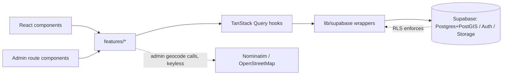
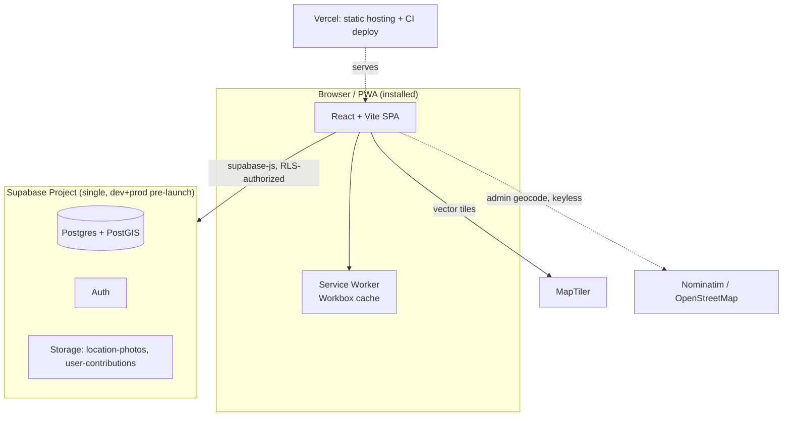
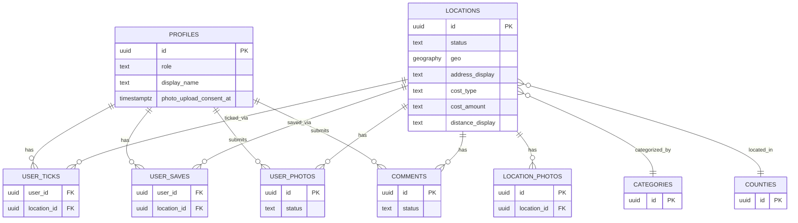

# Architecture Spine — Wander Éire

## Design Paradigm

**Client-heavy SPA over a BaaS backend.** The React/Vite app is the only application layer — there is no custom Express/Node API, and no Edge Function either: Supabase *is* the backend: Postgres+PostGIS for data, Auth for identity, Storage for photos, and Row-Level Security as the actual authorization boundary (not the React route guards, which exist for UX only). Admin geocoding (AD-5) calls a free, keyless third-party service directly from the client — no server-side secret to hide.

Layers map to directories as:

```text
src/
  routes/          # React Router route components — map to the IA table 1:1 (map, detail, profile, auth, admin/*)
  features/        # one dir per feature area (map, locations, ticks-saves, contributions, admin, auth) — components + hooks + TanStack Query calls for that feature
  lib/supabase/    # supabase-js client instance, typed table/RPC wrappers — the ONLY place raw supabase-js calls are made
  lib/query/       # TanStack Query client config, shared query keys
  components/      # cross-feature UI primitives (tack pin, filter chip, drawer sheet, button) per DESIGN.md
  pwa/             # service worker registration, offline fallback UI
supabase/
  migrations/      # source of truth for schema, RLS policies, triggers, storage bucket policies
```

## Invariants & Rules

### AD-1 — Platform stack [ADOPTED]

- **Binds:** all
- **Prevents:** re-litigating the platform per feature; `/admin` drifting into its own app/deployment.
- **Rule:** Frontend is React + Vite. Map is MapLibre GL JS over real coordinates (MapTiler vector tiles), illustrated-look styling. Backend is Supabase (Postgres+PostGIS, Auth, Storage). Mobile is PWA-first in v1; Capacitor wraps the same codebase for iOS/Android in a later phase — no rebuild, no parallel codebase. `/admin` is a route inside this same app/repo/deployment (per PROJECT-BRIEF.md) — never a separate app, build, or deployment target.

### AD-2 — RLS is the security boundary [ADOPTED]

- **Binds:** every table with user or role-scoped access; FR-18 (admin route)
- **Prevents:** a feature relying on a client-side check (route guard, hidden UI) as its *only* access control.
- **Rule:** Every write path is gated by a Postgres RLS policy keyed to `auth.uid()`. Admin-only reads/writes require the requester's `profiles.role = 'admin'` inside the policy itself, not just a React route guard hiding `/admin` in the UI. Client-side guards exist only to avoid flashing gated UI, never as the actual control.

### AD-3 — No custom backend

- **Binds:** all data access
- **Prevents:** an Express/Node (or similar) API layer creeping in for CRUD, ticks/saves, contributions, or admin operations.
- **Rule:** The app calls Supabase directly via `supabase-js`, routed through `lib/supabase/` wrappers, authorized by RLS (AD-2). Nothing earns a custom server-side function in v1 — geocoding (AD-5) is a direct, keyless client call, not a proxied one.

### AD-4 — Pin data strategy: fetch-all, client-side filter

- **Binds:** FR-1, FR-3, FR-4, FR-5 (Map & Discovery)
- **Prevents:** one feature re-querying Supabase on every pan/zoom while another assumes the full location set is already in memory — two incompatible data-loading models.
- **Rule:** The client fetches all `status = 'published'` locations in one query on load (via TanStack Query, cached). Category filtering (FR-3) and name search (FR-5) are pure client-side operations over that already-fetched set — never a re-query. `locations.geo` is still stored as `geography(Point, 4326)` with a GIST index (AD-20) so a future bbox/viewport query is additive, not a rewrite. Revisit this AD if published location count exceeds roughly 1,000 rows or the fetch payload exceeds ~1MB.

### AD-5 — Geocoding: Nominatim (OpenStreetMap)

- **Binds:** FR-20 (admin coordinate entry)
- **Prevents:** depending on an unverified/unreliable third-party service, or shipping a geocoding secret key inside the client bundle.
- **Rule:** Admin's address/Eircode→coordinate auto-fill calls Nominatim (`nominatim.openstreetmap.org`), OSM's official geocoder — free, keyless, no Edge Function/secret-hiding needed. Chosen after `eircode.dev` (originally considered) was found on verification to be an ~11-star single-commit hobby project that itself proxies Google Geocoding and requires a key — not a dependency worth taking for v1. Client respects Nominatim's usage policy (attribution, ~1 req/sec — trivial at admin-only, occasional-use volume). Map-click remains the always-available fallback (per EXPERIENCE.md's geocode-failure state) regardless of geocoder health or Eircode-match accuracy.

### AD-6 — Shared status-enum pattern for moderation and soft-delete

- **Binds:** `locations`, `user_photos`, `comments`; FR-16, FR-21, FR-22, FR-23
- **Prevents:** one table using a boolean+timestamp pattern (`archived_at`, `approved_at`) while another uses an enum — two query/RLS shapes for "is this thing live." Also prevents a literal-minded RLS implementation that silently blinds admin to non-public rows they need to see.
- **Rule:** `locations.status`: `published | archived` (archive = soft-delete, FR-22 — never a hard delete). `user_photos.status` / `comments.status`: `pending | approved | rejected`. Every public-facing query filters `WHERE status = 'published'` / `'approved'`; the admin moderation queue is `WHERE status = 'pending'` across `user_photos` + `comments`. **`locations` SELECT RLS is explicit:** `status = 'published' OR role = 'admin'` — public/anonymous sees published only, admin sees every status (required for FR-22's restore-from-archive flow, which needs to list archived rows).

### AD-7 — Category is a lookup table, not an enum

- **Binds:** `locations.category_id`; brief's "new categories get their own hue" extensibility intent
- **Prevents:** a hardcoded category enum requiring an `ALTER TYPE` migration + app redeploy every time a category (Food, Stay, ...) is added.
- **Rule:** `categories(id, name, color_hex, icon_key, sort_order)`, seeded with the v1 five (Trail/Emerald, Historic/Terracotta, Viewpoint/Amber, Beach-Coast/Ocean, Camping/Plum). `locations.category_id` FKs to it. Adding a category is an `INSERT`, not a schema change.

### AD-8 — County is a lookup table

- **Binds:** `locations.county_id`; Profile's "X of 32 counties" progress stat (EXPERIENCE.md)
- **Prevents:** free-text county values that typo-drift and break the county-completion stat's grouping.
- **Rule:** `counties(id, name)`, seeded with Ireland's 32 counties (no border distinction, per PRD §3). `locations.county_id` FKs to it. The progress stat is `COUNT(DISTINCT county_id)` over the user's ticked locations joined through `locations`.

### AD-9 — Photo pipeline: client-side compress before upload

- **Binds:** FR-14, FR-19 (admin photos), Photos section of the admin form
- **Prevents:** one upload path storing raw multi-MB originals while another compresses — inconsistent storage/egress cost and upload latency on mobile data.
- **Rule:** Every photo-upload path (admin location photos, user contribution photos) resizes to a max ~2000px dimension and re-encodes as JPEG at a target size of roughly 1–2MB, client-side, before the Storage call. No raw originals are stored.

### AD-10 — TanStack Query + supabase-js is the server-state layer

- **Binds:** all data fetching and mutation (locations, ticks, saves, photos, comments, admin CRUD, moderation)
- **Prevents:** each screen hand-rolling its own fetch/loading/error/optimistic-update logic, producing inconsistent UX (e.g. tick/save feeling instant on one screen, laggy on another).
- **Rule:** Every Supabase read/write goes through a TanStack Query hook (`useQuery`/`useMutation`) wrapping a `lib/supabase/` call. Tick/save toggles use optimistic updates with rollback on failure. Local-only UI state (open sheet, active filter chip, form field values) stays in plain React state/Context — never modeled as a TanStack Query cache entry.

### AD-11 — Two-bucket photo storage, RLS-gated pending content

- **Binds:** FR-14, FR-16, FR-19; §9 privacy/consent
- **Prevents:** a pending (unapproved) user photo being publicly fetchable by URL before admin approval — a real gap against FR-16's "not publicly visible until approved."
- **Rule:** `location-photos` bucket: public read, admin-write only, for admin-authored location photos (visible once the location is `published`), objects stored at `location-photos/{location_id}/{location_photos.id}.{ext}`. `user-contributions` bucket: private, objects stored at `user-contributions/{location_id}/{user_photos.id}.{ext}` — the path's second segment (minus extension) is the `user_photos.id`, which the RLS policy joins on to correlate a Storage object back to its row. A `storage.objects` RLS `SELECT` policy (and the identical **table-row** RLS `SELECT` policy on `user_photos`/`comments` themselves — without it a submitter's own pending row isn't even queryable, breaking the "Pending review" inline state) allows access only if: `status = 'approved'`, OR (`status = 'pending'` AND the requester is the submitter, `auth.uid() = user_photos.user_id`), OR the requester has `role = 'admin'`. **A rejected row is visible only to admin** (audit trail) — not to its own submitter, not publicly — matching EXPERIENCE.md's "no separate rejected notice, removed from the queue and no longer shown as pending in the submitter's own view."

### AD-12 — Anonymous Gate: client-tracked, no server state

- **Binds:** FR-8
- **Prevents:** building server-side view-tracking infrastructure for a gate the PRD explicitly scopes as soft/client-side for v1 (FR-8 note).
- **Rule:** A `localStorage` array of distinct viewed `location_id`s on that browser/device. Gate triggers when a *new* distinct id would become the 4th. No account/device fingerprinting, no DB table. Matches PRD's explicit acceptance of the cookie-clear bypass at this launch scale.

### AD-13 — Search is client-side substring match

- **Binds:** FR-5
- **Prevents:** building server-side full-text search infrastructure inconsistent with the fetch-all pin strategy (AD-4).
- **Rule:** Case-insensitive substring match against `locations.name`, over the already-fetched published set. Empty/no-match shows the explicit "Nothing here yet…" state (EXPERIENCE.md), never a blank list.

### AD-14 — profiles auto-provisioned by trigger; role is never client-writable

- **Binds:** FR-9, FR-10, FR-18
- **Prevents:** app code manually inserting `profiles` rows (race with signup) or a user granting themselves `role = 'admin'` via a client update.
- **Rule:** A Postgres trigger on `auth.users` INSERT creates the matching `profiles(id, role='user', display_name=NULL)` row. Plain RLS can't natively stop a user's own same-row `UPDATE` from also changing their own `role` column, so a second **`BEFORE UPDATE` trigger** (`prevent_role_self_change`) enforces it explicitly: raises an exception if `NEW.role <> OLD.role` and the requester is not already `role = 'admin'`. `role` only changes via direct DB access (AD-17) or a future admin-promotion tool built on top of this trigger's admin exception.

### AD-15 — Migrations are the schema source of truth

- **Binds:** all schema, RLS policies, triggers, storage bucket policies
- **Prevents:** the live Supabase project's actual RLS/schema drifting silently from what the repo and this spine describe — a real risk given how much authorization here lives in RLS, not app code.
- **Rule:** Every schema/policy/trigger change ships as a `supabase/migrations/*.sql` file, applied via the Supabase CLI (`supabase db push`) and CI — never hand-edited live in the dashboard as the primary authoring path.

### AD-16 — Account deletion cascade (GDPR)

- **Binds:** §9 privacy/GDPR
- **Prevents:** either over-deleting (breaking other users' view of already-public approved contributions) or under-deleting (leaving personal data live after a deletion request).
- **Rule:** On account deletion: `user_ticks` and `user_saves` rows are hard-deleted. `user_photos`/`comments` with `status = 'pending'` (or `'rejected'`) are hard-deleted along with their Storage objects. `status = 'approved'` `user_photos`/`comments` are **anonymized, not deleted**: `user_id` is set `NULL` (column nullable, `ON DELETE SET NULL`), content and photo file retained so the location's public detail page stays intact. `profiles` and the `auth.users` record are hard-deleted.

### AD-17 — Single Supabase project pre-launch [ADOPTED]

- **Binds:** deployment/environment setup
- **Prevents:** dev/prod environment split overhead before it's needed, and a paused-free-project surprise from splitting across the 2-project free-tier cap.
- **Rule:** One Supabase project serves both development and production until the public-launch milestone (PRD §1/§7). Schema is iterated locally via the Supabase CLI (Docker) and pushed to that one cloud project via migrations (AD-15). Revisit — split to a dedicated production project — at or before public launch.

### AD-18 — PWA offline scope: cached reads, no offline writes

- **Binds:** PWA installability (§6.2); FR-17 (explicit non-goal)
- **Prevents:** half-building an offline write queue that FR-17 explicitly rules out, or under-building the read path so "installable" doesn't actually mean "usable with no signal."
- **Rule:** `vite-plugin-pwa` (Workbox `generateSW`). App shell/static assets: precached, `StaleWhileRevalidate` on update. Locations dataset fetch: `NetworkFirst` with a short timeout, falling back to the last cached response (map still renders last-known data offline). Map tiles: `CacheFirst`, cached opportunistically as the user browses, capped via Workbox expiration (~500 entries / 30 days) — never pre-cached for the whole country. No offline write queue for ticks/saves/uploads: writes fail cleanly with the retry-prompt copy already specified in EXPERIENCE.md.

### AD-19 — Distance is a display string, not a structured measurement

- **Binds:** FR-6, FR-19 (Distance field)
- **Prevents:** a mismatch between admin-entered structured units and the free-form values real trail descriptions actually need (e.g. "2.4km loop" vs "2.4km").
- **Rule:** `locations.distance_display`: nullable text, matching the same free-form-with-qualifier pattern adopted for Cost Amount (AD-27). No numeric `distance_km` column in v1 — add one later only if sort/filter-by-distance becomes a real feature.

### AD-20 — Location coordinates: PostGIS geography(Point, 4326)

- **Binds:** `locations.geo`
- **Prevents:** a schema rewrite if/when bbox or "nearby" distance queries are added post-v1.
- **Rule:** `locations.geo geography(Point, 4326)` with a GIST index, set now even though AD-4's v1 query pattern doesn't yet exercise it. `geography` (not `geometry`) for correct meters-based distance semantics out of the box.

### AD-21 — Admin location photos are a child table

- **Binds:** FR-19; brief's draft `admin_photos[]` field
- **Prevents:** an array-column photo list, which makes individual deletion/reordering awkward and breaks the lookup-table-for-lists pattern already set by AD-7/AD-8; also prevents an FK-ordering deadlock in the admin create flow.
- **Rule:** `location_photos(id, location_id FK NOT NULL, storage_path, sort_order, created_at)`, files in the `location-photos` bucket (AD-11) at `location-photos/{location_id}/{location_photos.id}.{ext}`. The brief's draft `admin_photos[]` is realized as this table, not a Postgres array column. **Upload ordering:** the admin form's Photos section stages selected files client-side (compressed per AD-9, held as in-memory object URLs) during fill-in — actual Storage upload and `location_photos` row inserts happen only *after* the `locations` row itself is successfully inserted on Submit, using its new id, as one sequenced client-side operation. This satisfies the NOT NULL FK without introducing a draft/staged location state (FR-21 forbids one).

### AD-22 — Photo upload input constraints

- **Binds:** FR-14 (resolves PRD §15 assumption)
- **Prevents:** an unbounded/unvalidated upload hitting the client-side compression step (AD-9) or Storage with no guard at all.
- **Rule:** Accepted input MIME types: `image/jpeg`, `image/png`, `image/heic`, `image/webp`. Hard input-size cap 15MB per file, rejected client-side with an inline error before compression runs. No per-location or per-user count cap on photos in v1 — PRD's own placeholder confirmed as final, not provisional; the moderation-volume risk against FR-23's single-admin queue is accepted for v1 (see Deferred).

### AD-23 — Comment length cap

- **Binds:** FR-15 (resolves PRD §15 assumption)
- **Prevents:** an unbounded comment field with no enforced length anywhere, and a client-only limit that a direct API call could bypass.
- **Rule:** `comments.text` capped at 500 characters via a DB `CHECK` constraint, matched by client-side `maxlength`. No per-location/per-user comment count cap in v1, same rationale/risk-acceptance as AD-22.

### AD-24 — Photo-upload consent tracking

- **Binds:** §9 privacy/consent, FR-14
- **Prevents:** consent being asked (or silently skipped) per-submission, or not tracked at all.
- **Rule:** `profiles.photo_upload_consent_at` (nullable `timestamptz`), set once on first upload or at signup. A user is shown the consent acknowledgment only when this is `NULL`; every later upload skips it, per EXPERIENCE.md Flow 3.

### AD-25 — Privacy policy is a static route

- **Binds:** §9 privacy
- **Prevents:** the privacy policy requirement (§9) going unaddressed entirely, or getting built as a DB-backed/CMS page it doesn't need.
- **Rule:** `/privacy`, statically-rendered content (no CMS/DB table), linked from the auth modal footer and profile menu per EXPERIENCE.md's IA table.

### AD-26 — Pending gated action survives OAuth redirect via sessionStorage

- **Binds:** FR-8, FR-9 (Anonymous Gate + Google sign-in), EXPERIENCE.md Flow 1
- **Prevents:** AD-10's "local UI state stays in plain React state" rule silently failing the one flow where it can't survive — a full-page OAuth redirect.
- **Rule:** Before calling `supabase.auth.signInWithOAuth` (Google — a full-page redirect away and back), the app writes the pending gated action (`{type: 'view_detail' | 'tick' | 'save', location_id}`) to `sessionStorage`. The auth callback route reads and clears it on return, then executes the resumed action. Email/password sign-in (in-modal, no navigation) does not need this — plain React state survives fine there, consistent with AD-10.

### AD-27 — Location address/Eircode and Cost fields

- **Binds:** FR-6, FR-7, FR-19 (resolves a gap found in rubric review: FR-7's copyable address and Cost Type/Amount had no governing AD or ERD field)
- **Prevents:** FR-7's copy-to-clipboard address/Eircode having no data source, and AD-19's reference to an "already-adopted Cost Amount pattern" that was never actually specified anywhere.
- **Rule:** `locations.address_display` (text, admin-entered) — always populated regardless of which coordinate-entry path (AD-5 geocode vs. map-click) admin used, since map-click alone captures no address. `locations.cost_type` (enum: `free | paid`), `locations.cost_amount` (nullable text, allows a qualifier per PRD Glossary, e.g. "€10 parking" vs. plain "€18").

**Dependency direction:**



No layer skips its neighbor: components never call `supabase-js` directly, only through a Query hook; Query hooks never construct raw Postgres/Storage calls, only through `lib/supabase/` wrappers — this is what keeps every RLS-authorized call going through one auditable seam.

## Consistency Conventions

| Concern | Convention |
| --- | --- |
| Naming (tables, columns) | snake_case Postgres tables/columns; plural table names (`locations`, `user_photos`); FK columns as `{singular}_id` (`category_id`, `county_id`, `location_id`). |
| Naming (React) | PascalCase components, camelCase hooks/functions; feature dirs under `src/features/` named after the PRD feature areas (§4.1–§4.6). |
| Status/moderation fields | Always `status` (enum-shaped text or Postgres enum type), never a bespoke boolean+timestamp pair — see AD-6. |
| IDs | `uuid` primary keys everywhere (Supabase default via `gen_random_uuid()`), including lookup tables (`categories`, `counties`) for FK consistency. |
| Timestamps | `timestamptz`, `created_at` default `now()` on every table; `updated_at` only where rows are actually mutated post-insert (`locations`, `profiles`). |
| Auth/authorization | RLS is the only authorization boundary (AD-2); every table has explicit policies, never a bare "authenticated users can do anything" fallback. |
| Data mutation & caching | TanStack Query only (AD-10); optimistic updates for tick/save; no direct component-level `supabase-js` calls outside `lib/supabase/`. Query keys namespaced `[entity, scope, ...params]` — e.g. `['locations','published']` (map/public) vs. `['locations','admin-all']` (admin list) never share a key; `['ticks', userId]` / `['saves', userId]` are invalidated by their own mutations on success/settle. |
| Errors & empty states | Copy exactly as specified in EXPERIENCE.md's State Patterns table (warm, in-voice, no raw error codes surfaced to users). |
| Config/secrets | `VITE_SUPABASE_URL` / `VITE_SUPABASE_ANON_KEY` as public Vercel env vars (safe — RLS is the real boundary). No server-side secrets in v1 (geocoding is keyless, AD-5); if one is ever needed, it lives only in a Supabase Edge Function's secret store, never in a `VITE_*` var. |
| Content moderation | Admin manual review only (FR-16, FR-23) — no AI flagging, profanity filter, or other automated moderation gets added, even as a "helper," per PRD §5's explicit non-goal. |

## Stack

| Name | Version |
| --- | --- |
| React | 19.x |
| Vite | 8.x current line (verified 2026-08) |
| TypeScript | current stable |
| MapLibre GL JS | current stable |
| Map tiles | MapTiler (free tier: 100k tile requests/mo, 100MB hosting) |
| Supabase (Postgres + PostGIS + Auth + Storage) | current hosted platform |
| supabase-js | v2.x |
| TanStack Query | v5.x |
| vite-plugin-pwa (Workbox) | current stable |
| Capacitor | 8.x current line (verified 2026-08; later phase, not v1 — re-check pin before that phase starts) |
| Hosting | Vercel |
| Geocoding | Nominatim (OpenStreetMap) — see AD-5 |

## Structural Seed

**System/container view:**



**Core-entity ERD (names + relationships only — column detail lives in migrations):**



`user_ticks` and `user_saves` are join tables keyed on `(user_id, location_id)` — one row per tick/save, unique constraint prevents duplicates.

**Minimal source tree:**

```text
wander-eire/
  src/
    routes/            # map, detail/:id, profile, admin/*, auth, auth/callback, privacy — mirrors EXPERIENCE.md IA table
    features/
      map/              # pin rendering, filter chips, map/list toggle (FR-1..FR-5)
      locations/         # detail view, directions copy (FR-6, FR-7)
      auth/              # sign-up/sign-in modal, anonymous gate, OAuth callback + pending-action resume (FR-8, FR-9, AD-26)
      profile/           # ticked/saved tabs, account settings, account deletion (FR-10, FR-13, AD-16)
      contributions/      # photo/comment upload, upload consent (FR-14, FR-15, AD-22..AD-24)
      admin/              # location CRUD form + location_photos, moderation queue (FR-18..FR-23, AD-21)
    lib/
      supabase/          # client instance + typed table/RPC wrappers (only raw supabase-js call site)
      query/              # TanStack Query client + shared query keys
      geo/                 # client-side photo compression, geocode client call
    components/          # tack-pin, filter-chip, drawer-sheet, button, etc. — DESIGN.md components
    pwa/                  # service worker registration
  supabase/
    migrations/           # schema, RLS policies, triggers, bucket policies — source of truth (AD-15)
  public/
```

## Capability → Architecture Map

| Capability / Area | Lives in | Governed by |
| --- | --- | --- |
| Map & Discovery (FR-1–FR-5) | `features/map/` | AD-4, AD-13, AD-20; FR-2 (own location) is a bare `navigator.geolocation` call, no architectural decision needed |
| Location Detail (FR-6, FR-7) | `features/locations/` | AD-6 (status filter), AD-19 (distance), AD-27 (address/cost) |
| Access Gate & Accounts (FR-8–FR-10) | `features/auth/` | AD-12, AD-14, AD-26 |
| Personal Tracking (FR-11–FR-13) | `features/profile/` | AD-10, AD-8 (county stat) |
| User Contributions (FR-14–FR-17) | `features/contributions/` | AD-6, AD-9, AD-11, AD-18, AD-22, AD-23, AD-24 |
| Admin Management (FR-18–FR-23) | `features/admin/`, `routes/admin/*` | AD-2, AD-5, AD-6, AD-7, AD-8, AD-15, AD-21 |
| Privacy policy, GDPR / account deletion (§9) | `routes/privacy`, `features/profile/` (settings) | AD-16, AD-24, AD-25 |

**Build sequencing** (PRD §6.1's 3 phases) is owned by epics/stories, not this spine — noted here so nothing below silently contradicts it. Nothing in this spine blocks phase 1 (map + admin CRUD, no accounts) shipping before phase 2 (auth + tracking + contributions): RLS policies allow anonymous `SELECT` on published locations without requiring signup, so auth-dependent tables (`user_ticks`, `user_saves`, `user_photos`, `comments`, the `profiles` trigger) simply go unused until phase 2 wires up Supabase Auth. Phase 3 (PWA polish + Capacitor) only touches AD-1/AD-18, already scoped for that later pass.

## Deferred

- **Nominatim accuracy fallback** (AD-5) — if Nominatim's Ireland/Eircode match accuracy proves insufficient during implementation, MapTiler Geocoding API (same vendor as the map tiles, one bill to watch) is the fallback; would need Edge Function key-hiding, unlike Nominatim.
- **Automated testing strategy** — not specified by PRD/UX; no test framework or coverage bar fixed by this spine. Left to implementation discretion for a solo builder using Claude Code; revisit if defect/regression rate makes it worth fixing here.
- **Observability/analytics** — no logging or analytics stack chosen for v1; PRD sets no numeric performance target (§8, open question 5) and no monitoring requirement. Revisit if SM-1–SM-4 (PRD §7) need instrumentation to measure.
- **Server-side split of dev/prod Supabase projects** — deferred past AD-17 to the public-launch milestone.
- **Viewport/bbox PostGIS querying** — deferred past AD-4's fetch-all pattern until location count or payload size crosses the stated trigger.
- **Distance as a structured/numeric field** — deferred past AD-19 until distance-based sort/filter is an actual feature.
- **Anonymous Gate hardening against cookie-clear bypass** (PRD §14 Q4) — explicitly deferred by the PRD itself to a possible public-launch scale problem, not decided here.
- **Per-user rate limiting on photo/comment contributions** (AD-22, AD-23) — v1 has no count cap, relying on the solo admin's manual moderation review (FR-23) to absorb volume. Revisit if contribution volume ever makes the single-admin moderation queue the actual bottleneck.
- **Native app-store build (Capacitor wrap)** — deferred to the phase-3 build sequence (PRD §6.1); this spine's stack (AD-1) keeps it a same-codebase addition, not a rewrite, but the wrap itself isn't architected here.
- **Public leaderboard/social layer** — explicit PRD non-goal (§5); no schema or component seed reserves space for it, per EXPERIENCE.md's anti-pattern list (no ad-shaped slots, no premium badges reserved for later).
